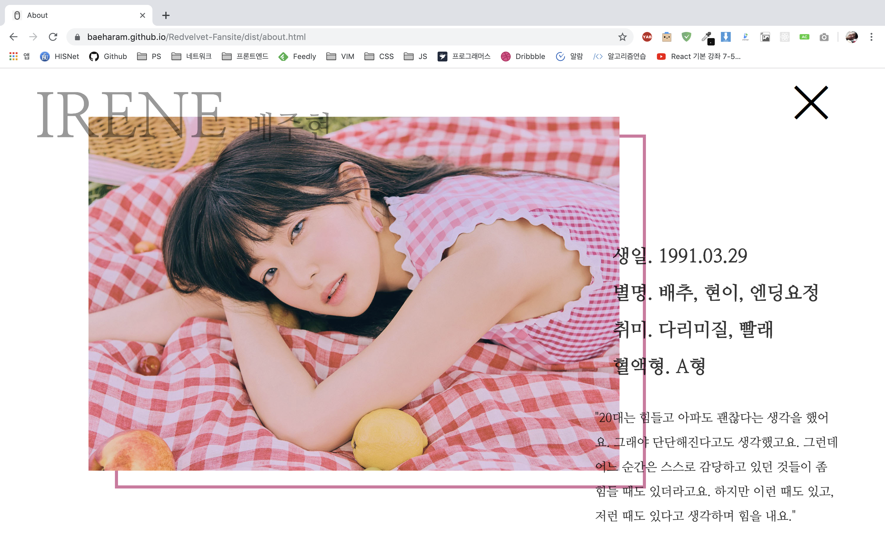
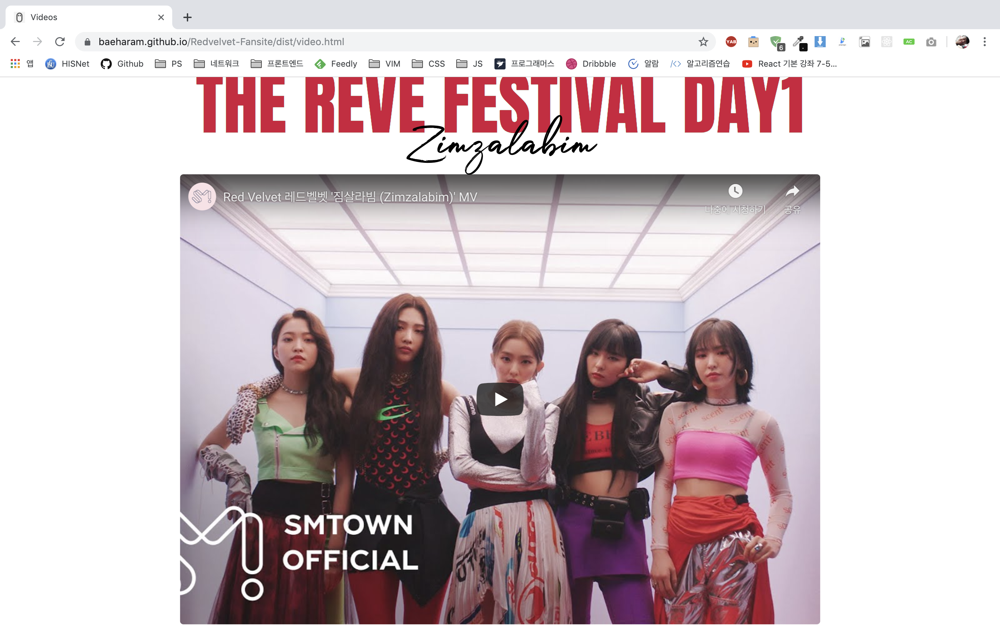

# 레드벨벳 팬사이트

  

## 프로젝트 소개

레드벨벳의 팬사이트를 제작하는 프로젝트로 레드벨벳의 공식 사이트가 마음에 들지 않아 포트폴리오 및 웹개발 공부 겸 제작하게 되었습니다. 레드벨벳의 멤버 5명에 대한 소개와 사진, 앨범, 비디오 페이지를 통해 레드벨벳이 어떤 그룹인지에 대해 소개하는 프로젝트입니다. [웹사이트](https://baeharam.github.io/Redvelvet-Fansite/dist/index.html) 에서 실제 프로젝트의 작동을 확인할 수 있습니다.

 

## 웹사이트 화면

|                       홈                       |                    멤버소개                     |
| :--------------------------------------------: | :---------------------------------------------: |
|  |  |

|                     멤버소개 상세                      |                      사진                       |
| :----------------------------------------------------: | :---------------------------------------------: |
|  |  |

|                      앨범                       |                     비디오                      |
| :---------------------------------------------: | :---------------------------------------------: |
|  |  |

 

## 사용해 본 기술 및 프로그램들과 배운 것들

|                 마크업 언어                  |                 스타일 언어                 |              프로그래밍 언어               |                   모듈 번들러                   |
| :------------------------------------------: | :-----------------------------------------: | :----------------------------------------: | :---------------------------------------------: |
|  |  |  |  |
|                   **HTML**                   |                   **CSS**                   |               **Javascript**               |                   **Webpack**                   |

|                   웹 호스팅                    |
| :--------------------------------------------: |
|  |
|                   **Github**                   |

 

### HTML/CSS

백지에서 마크업을 하고 스타일을 적용해본 적은 처음이라 어디서부터 시작해야할지 감이 안왔지만 [오프라인 강의](https://veamcamp.com/camp/htmlcss-secondstep/#upcoming) 를 통해서 배웠던 내용들을 적용해보면서 어떤 방식으로 마크업을 해야할지 배울 수 있었습니다. 또한 CSS를 짤 때는 "멤버소개" 화면에서 5개의 영역으로 나누는 것, "홈" 화면에서 일정 간격으로 배경 이미지를 전환하는 것, "멤버소개 상세" 화면과 같은 배치 구조를 짜는 것 등에서 많이 문제가 발생했는데 이런 문제들을 해결해 나가면서 CSS 실력을 조금 더 견고히 할 수 있었습니다.

### JS

바닐라 JS를 사용하면서 JS에 좀 더 익숙해질 수 있었고 DOM을 제어하고 CSS와 연동하는 것을 통해 다양한 이슈를 경험할 수 있었습니다.

* 사용자가 스크롤함에 따라서 나타나는 효과와 이미지의 lazy loading 구현을 본래의 계산 방식으로 할 것인가 아니면 IntersectionObserverAPI를 활용할 것인가?
  * 웹사이트 상에 스크롤에 따른 효과를 주거나 lazy loading을 구현하기 위해선 대표적으로 2가지 방법이 있었고 그 방법들은 각각의 장단점을 가지고 있었습니다. IntersectionObserverAPI의 경우 비교적 최근에 나온 API였고 미세한 조정이 힘들었기 때문에 그런 경우엔 전통적인 계산방식을 사용했고, 간단한 fade in/out 정도의 경우라면 계산 자체의 비용이 크기 때문에 API를 사용하였습니다.
* HTML에 클래스를 추가해서 스타일을 전환시킬 때 어떤 것 기준으로 클래스를 추가해야 JS를 덜 사용할 수 있을까? 즉, CSS를 어떻게 최대한 활용할 수 있을까?
  * 이 부분은 스타일을 클래스 명에 따라서 전환시킬 때 해당 엘리먼트에만 클래스를 추가하는 단순한 방법을 사용하였는데, [Code Review StackExchange](https://codereview.stackexchange.com/questions/225869/event-triggers-for-animations-using-vanilla-es6) 에서 직접 코드 리뷰를 받아본 후에 상위 엘리먼트에 추가하는 방식이 훨씬 더 간단하고 효율적이라는 것을 배웠습니다.

### Webpack

웹팩을 사용하게 된 이유는 아래의 이유였습니다.

* 여러가지 CSS 속성들에 각각 vendor prefix를 붙여야 하는데 간단한 방법이 없을까?
* JS의 ES6+ 문법들을 Babel로 처리해야 하는데 어떻게 한번에 처리할 수 있을까?
* 각 페이지마다 요청하는 CSS/JS 파일이 많은데 HTTP 요청을 최소화 할수는 없을까?

구글링을 했고, 다양한 방법들이 나왔는데 그 중에서 요즘 제일 많이 쓰이고 통합적인 기능을 제공하는 것이 바로 웹팩이었습니다. 웹팩 설정에 정말 고생을 했고 삽질도 많이 하면서 웹팩에 좀 더 익숙해지게 되었고 필요성이 실제적으로 느껴졌습니다.

### Github Web Hosting

보통 개발 블로그를 할 때 깃헙 호스팅을 사용하는데, 웹사이트를 호스팅 할 수는 없을까 하고 생각해보게 되었습니다. 그래서 찾아보니 정적인 사이트는 모두 호스팅 할 수 있다고 나왔고 이 팬 사이트에서 오고가는 데이터가 모두 정적인 것이기 때문에 여기에 호스팅 시키기로 결정했습니다. 호스팅을 진행하면서 Git의 submodule 개념을 알아야 했기 때문에 이것도 배울 수 있었고 하나의 계정에 여러개의 웹사이트를 URL형식으로 호스팅 할 수 있다는 것도 새롭게 배우게 되었습니다.

 

## 아쉬웠던 점

* **좋다고 하는 기능/플러그인/옵션들의 남용**

프로젝트를 진행하면서 좋다고 하는 것들을 갖다 썼는데, 예를 들어 ESLint, Stylelint 나 Webpack의 여러 플러그인들을 많이 사용했습니다. 물론 확실히 어떤 것이 좋은지 알고 사용한다면 유익하겠지만 정확하게 어떤 건지 모르고 좋다고 사용한 것들이 꽤 있었고 프로젝트의 복잡성을 증가시키는데 많이 기여가 되었습니다. 여기서 깨달은 점은, 좋다고 무조건 사용하는 것이 아니라 그것을 사용하는 이유를 파악하고 해당 기능이 현 시점에서 정말로 필요한가를 생각해봐야 한다는 것입니다.

* **이미지 로딩속도 개선의 한계**

연예인의 팬 사이트이다 보니 이미지가 상당히 많을 수밖에 없는데 이 때문에 웹사이트의 로딩 지연 이슈가 많이 발생하였습니다. 이미지의 용량이 큰 점, 이미지의 양이 많은 점 등 다양한 문제점들이 있어서 이미지를 최대화면 크기에 맞게 자르고 압축하고 레이지 로딩을 적용하였습니다. 그러나 여전히 이미지의 로딩은 느렸고 원인을 파악할 수 없었습니다. 이미지 자체의 문제가 아닌 이유는 다른 웹사이트와 비교했을 때 적당량의 용량인데도 불구하고 다른 웹사이트의 로딩속도가 빨랐기 때문입니다. 그 웹사이트는 CDN을 사용하여 데이터를 가져왔는데 이것이 깃헙 호스팅의 문제인 것 같기도 합니다. 다음번엔 이미지를 포함한 속도에 영향을 줄 수 있는 데이터들을 조금 더 신경써야 할 듯 싶습니다.

* **무분별한 CSS 기법 및 스타일**

CSS를 작성할 때 가장 중요한 것은 해당 속성을 왜 사용했으며, 그 속성이 크게 볼 때 정말 최적인가에 대한 질문을 던지는 것입니다. 그러나 기능을 구현하는데 집중한 나머지 중요성을 앎에도 불구하고 별로 중요하지 않은 문제로 치부하고 말았습니다. 그래서 CSS의 전체적인 구조가 복잡해졌고 거기다 BEM(Block-Element-Modifier) 방법론을 어줍잖게 사용한 나머지 가독성이라던가 유지보수성 또한 상당히 떨어졌습니다. 실수한 점은 먼저 큰 구조를 짜지 않고 하나하나의 구성요소에 대한 스타일을 짰던 것입니다. 즉, 레이아웃 구조부터 크게 잡고 유지보수성이 높은 방식으로 짜나가야 하는데 그러지 않았던 점이 문제였습니다. 또한 방법론에 대해 확실히 공부하지 않고 나서 적용한 것도 문제였는데 이는 네이밍 방식이 계속 섞이는 치명적인 문제를 발생시켰습니다. 따라서 이를 통해서 CSS에를 짤 때의 마음가짐을 다시 새롭게 하게 되었습니다.

 

## 저작권

레드벨벳의 팬 사이트이기 때문에 사진 및 비디오 등의 저작물에 대한 모든 저작권은 SM 엔터테이먼트에 있습니다.